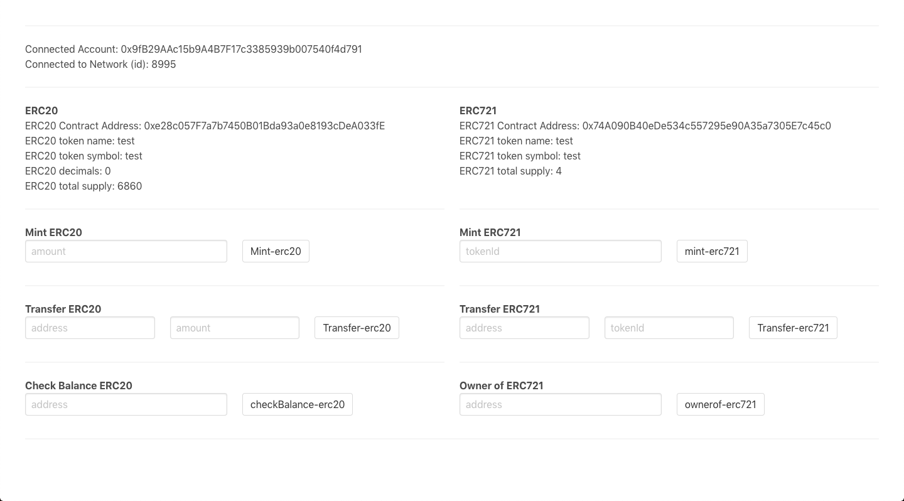

# Key Management Approaches

## Description
The repository demonstrates token functions (ERC721/ERC20 - minting, transfer, check-balance) using three separate key management approaches:

- Metamask
- Wallet Connect
- Portis

## Usage
1. Clone the repository
2. Install dependencies
    ```bash
    npm install
    ```
3. Checkout on respective branches for the separate approaches:
    - Metamask 
        ```bash
        git checkout master
        ```
    - Wallet Connect
        ```bash
        git checkout walletconnect
        ```
    - Portis
        ```bash
        git checkout portis
        ```
4.  ```
    npm run serve
    ```